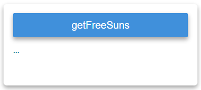
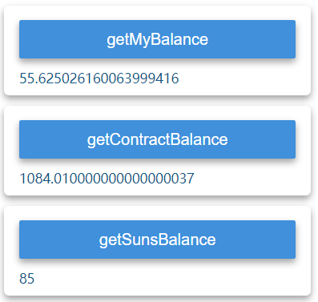
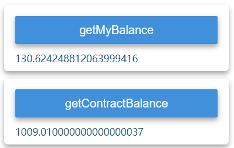

# Ether Sunflowers

> An Ethereum DApp, Ether Sunflowers
>
> github地址：https://github.com/wuzht/EtherSunflowers

<!-- TOC -->

- [Ether Sunflowers](#ether-sunflowers)
    - [选题背景与依据](#选题背景与依据)
    - [项目描述](#项目描述)
    - [实现步骤](#实现步骤)
        - [用Remix编写并部署智能合约](#用remix编写并部署智能合约)
        - [用web3 API编写node.js服务端程序](#用web3-api编写nodejs服务端程序)
        - [编写web客户端程序](#编写web客户端程序)
    - [用户界面](#用户界面)
        - [整体界面](#整体界面)
        - [页面布局](#页面布局)
    - [使用说明与测试](#使用说明与测试)
        - [测试环境描述](#测试环境描述)
        - [启动geth](#启动geth)
        - [启动web服务器](#启动web服务器)
        - [打开web客户端网页](#打开web客户端网页)
        - [通过web客户端网页与合约进行交互](#通过web客户端网页与合约进行交互)
            - [选择账号](#选择账号)
            - [左边栏](#左边栏)
            - [中间栏和右边栏](#中间栏和右边栏)
            - [getFreeSuns](#getfreesuns)
            - [getSunflowersBySuns](#getsunflowersbysuns)
            - [work](#work)
            - [quit](#quit)
            - [rest](#rest)
            - [buySuns](#buysuns)
            - [sellSuns](#sellsuns)
            - [donate](#donate)

<!-- /TOC -->

## 选题背景与依据

如今，许许多多的学生以及工作者，或多或少都会有些惰性，在面对学业或工作的压力时，由于没有很好的时间管理意识，很多人会成为一个"拖延症"患者。即接到工作任务后，不是立刻去努力完成，而是懒惰地消耗时间，不到DDL(Deadline)就不会去做。当时间越靠近DDL就会越焦虑，于是最终把工作任务草率地完成，质量很低。如此一来，”拖延症“不断地恶性循环，最终导致大量的时间荒废。

EtherSunflowers是一款有趣的应用，是运行于以太坊的一个智能合约，通过web客户端与用户进行交互。EtherSunflowers就是为了拯救”拖延症“患者而诞生的，结合区块链的特性，协助用户培养自己的时间管理意识，克服惰性，提升工作效率。

EtherSunflowers结合了游戏的元素，通过游戏内的奖惩机制，来培养用户的时间意识。EtherSunflowers协助用户采用”25+5“模式，即认真工作25分钟，然后休息5分钟，实现最佳的工作效率。用户在工作时通过奖惩机制来帮助自己提升时间意识，同时在休息时可以通过游戏买卖来作为娱乐，放松身心。当用户开启了一个时钟周期（开始工作），若正常完成，就会得到奖励；若中途结束，则会受到惩罚。

其中，所有的数据都保存到区块链中，数据不可篡改，根据用户已完成的时钟周期与中途退出的时钟周期的多少，即可了解用户自己的时间管理意识。


## 项目描述

- 时钟周期定义：

  25分钟工作时间 + 5分钟休息时间

- EtherSunflowers 内有2种主要对象：

  - 阳光 sun
  - 向日葵 sunflower

- 每个用户有自己的 EtherSunflowers 账户，有以下对象：

  - successAmount。已完成的时钟周期数，初始值为0
  - failAmount。中途退出的时钟周期数，初始值为0
  - sun。sun 数量，初始值为0
  - sunflowersNum。sunflowers 数量，初始值为0

- 合约规则：

  - 获得更多的sun
    * 当用户没有 sun 时，可以免费获取10个 sun
    * 可以购买 sun，每个sun的价格为1 ETH
  - 每消耗10个 sun 能获得1个 sunflower。
  - 进入工作状态，会得到 20*(拥有的 sunflower 数量)的 sun，并且当前账号的 sunflower数量变为0
  - 如果在工作时中途退出，那么失败数 failAmount 加一，并且减少5个 sun。
  - 如果工作完成，进入休息状态，那么成功数 successAmount 加一。
  - 可以卖出 sun，如果合约够钱的话。一个 sun 的价钱为1 ETH。
  - 用户也可以捐钱给合约。

* 项目逻辑图：


## 实现步骤

### 用Remix编写并部署智能合约

合约代码文件位于`./contract/EtherSunflowers.sol`

合约状态变量

```javascript
mapping (address => uint256) private sunsBalances;   // the suns balances of an address
mapping (address => uint256) private sunflowersNum;  // the sunflowersNum of an address
mapping (address => uint256) private successAmount;  // amount of finishing a cycle
mapping (address => uint256) private failAmount;     // amount of fail finishing a cycle

uint256 private INIT_SUNS_NUM = 10;   // initial number of suns
uint256 public constant sunPrice = 1 ether;
```

- `sunsBalances` mapping (address => uint256)。保存用户的sun数量
- `sunflowersNum` mapping (address => uint256)。保存用户的sunflower数量
- `successAmount` mapping (address => uint256)。保存用户的成功完成的时钟周期数
- `failAmount` mapping (address => uint256)。保存用户的中途退出的时钟周期数
- `INIT_SUNS_NUM` uint256。赠送sun的数量
- `sunPrice` uint256。sun的单价，设为 1 ETH

定义一个函数结束的状态，在函数结束时调用（`emit FunctionEndEvent();`），用于在js中监听合约交易完成的事件（后面详细叙述）。

`event FunctionEndEvent();`

合约接口

- `constructor() public`

  构造函数，初始化相关状态变量

- `function getContractBalance() public view returns (uint256)`

  返回合约当前的余额 (ETH)

- `function getSunsBalance() public view returns (uint256)`

  返回用户的sun数量

- `function getSunflowersNum() public view returns (uint256)`

  返回用户的sunflower数量

- `function getSuccessAmount() public view returns (uint256)`

  返回用户已完成的时钟周期数

- `function getFailAmount() public view returns (uint256)`

  返回用户的中途退出的时钟周期数

- `function getFreeSuns() public`

  当用户没有 sun 时，可以调用一次该函数，免费获得10个sun

- `function getSunflowersBySuns(uint256 _sunflowersNum) public`

  - `uint256 _sunflowersNum` 要换取的sunflowers数量

  用suns换取sunflowers，每10个suns换取1个sunflowers

- `function work() public`

  进入工作状态，会得到 20*(拥有的 sunflower 数量)的 sun，并且当前账号的 sunflower数量变为0

- `function quit() public`

  在工作时中途退出，失败数 failAmount++，并且减少5个 sun。

- `function rest() public`

  工作完成，进入休息状态，成功数 successAmount++

- `function buySuns() public payable`

  用户通过传入`value`买入sun，1 ETH 买入1个sun

- `function sellSuns() public`

  用户卖出当前拥有的sun，获取ETH，如果合约够钱的话。一个 sun 的价钱为1 ETH。

- `function donate() public payable`

  用户通过传入`value`向合约捐钱


### 用web3 API编写node.js服务端程序

服务端程序代码位于`./web/index.js`

在Remix上编译并部署合约后，得到合约地址`address`和`abi`，复制到服务端代码`web/index.js`中，并获取合约：

```javascript
var ethersunflowersContract = web3.eth.contract(abi).at(address);
```

创建HTTP服务器，端口为8000，响应web客户端请求：

```javascript
// http server
http.createServer(function(req, res) {
    var pathname = url.parse(req.url).pathname;
    var mimeType = getMimeType(pathname);
    if (!!mimeType) {
        handlePage(req, res, pathname);
    } else {
        handleAjax(req, res);
    }
}).listen(port, function() {
    console.log('server listen on port', port);
});
```

web客户端通过异步请求，服务端调用合约的函数，并将结果返回给web客户端。

根据客户端`url`的请求的函数名，调用相应的合约函数。

请求`url`的格式在下一步详细叙述。

通过`call`的方式调用的函数只在节点本地虚拟机中执行，不会产生交易，不会花费费用，不会修改数据。因此调用可以直接返回数据的内容，或者是只通过`call`方式调用的函数，如下处理客户端的请求：

```javascript
if (functionName == "getMyBalance") {
    sendMessage(res, web3.fromWei(web3.eth.getBalance(from), 'ether'));
}
else if (functionName == "getContractBalance") {
    ethersunflowersContract.getContractBalance.call({from:from}, function(error, result){
        if (!error) {
            sendMessage(res, web3.fromWei(result, 'ether'));
        } else {
            sendMessage(res, error);
        }
    });
}
```

其中`sendMessage`函数为：

```javascript
function sendMessage(res, msg) {
    res.writeHead(200, {
        'Content-Type': 'text/plain'
    });
    res.end("" + msg);
}
```

当通过`.sendTransaction()`调用合约的时候，交易会被提交到区块链进行处理，这个处理需要一定的时间，如果需要等交易完成之后再执行其他操作，就必须要知道交易何时完成，那么如何知道交易何时完成呢？可以通过监听合约事件来实现。

前面在合约中定义了函数结束事件`event FunctionEndEvent();`，在函数结束时调用（`emit FunctionEndEvent();`）。在web3中使用事件，首先获取事件对象，然后监听事件，如果事件发生，就会在回调函数中获取到事件信息。

如buySun的处理，获取请求url中的value字段，调用合约函数，监听函数结束事件`FunctionEndEvent`，当区块链确认交易后，才将结果返回给客户端：

```javascript
else if (functionName == "buySuns") {
    var value =  querystring.parse(urlQuery).value;
    value = web3.toWei(value, 'ether');
    console.log(value);
    ethersunflowersContract.buySuns.sendTransaction({from:from, value:value}, function(error, txhash) {
        var msg = "";
        if (!error) {
            msg = txhash;
        } else {
            msg = error;
            sendMessage(res, msg);
            return;
        }
        var myEvent = ethersunflowersContract.FunctionEndEvent();
        myEvent.watch(function(err, result) {
            if (!err) {
                if (result.transactionHash == txhash) {
                    ethersunflowersContract.getSunsBalance.call({from:from}, function(err1, result1){
                        if (!err1) {
                            msg += "\ngetSunsBalance: " + result1;
                        } else {
                            msg += "\ngetSunsBalance error: " + err1;
                        }
                        sendMessage(res, msg);
                        console.log("end of buySuns.");
                    });
                }
            } else {
                msg += "\nmyEvent error: " + err;
                sendMessage(res, msg);
                console.log("end of buySuns.");
            }
            myEvent.stopWatching();
        });
    });
}
```


### 编写web客户端程序

web客户端程序的相关代码位于`./web/page`目录下。

当用户点击按钮时，向服务端发送异步请求，在请求url中传入`from`和`value`等参数。服务端收到客户端的请求，然后处理合约的函数调用，当区块链确认交易后，服务端将结果返回给客户端，在用户界面上显示，并且更新左栏相关的信息。

如用户点击购买sun的按钮：

```javascript
var url = "http://localhost:8000?functionName=buySuns&from=" + from + "&value=" + value;	// 请求的url，包含函数类型，以及from和value的值
var request = $.get(url, function(data) {	// 向服务端发送get请求
	console.log(data);
	$("#error-buySuns").html(data);		// 在按钮下方显示信息
	$("#getMyBalance").click();			// 刷新信息
	$("#getContractBalance").click();	// 刷新信息
	$("#getSunsBalance").click();		// 刷新信息
});
```


## 用户界面

### 整体界面


### 页面布局

- `Current account`，这是一个下拉菜单，在 geth 中创建好的账户会在这里显示，用于选择账号。

  

- 与合约交互的按钮。分为左边栏，中间栏和右边栏。

  

- `Instructions`，用户指引。


## 使用说明与测试

**使用前，请在github上把整个项目`clone`到本地，并且不要删除任何文件。**

github地址：https://github.com/wuzht/EtherSunflowers

文件结构：

```javascript
EtherSunflowers			// 根目录
│  EtherSunflowers.url 	// web客户端快捷方式，打开http://localhost:8000/page/index.html
│  README.md 			// 制品文档
│      
├─contract
│      EtherSunflowers.sol	// 合约代码
│      
├─geth
│  │  genesis.json
│  │  geth.exe
│  │  geth.log
│  │  StartGeth.bat			// 双击打开，运行geth
│          
└─web
    │  index.js				// web服务器程序
    │  StartWebServer.bat	// 双击启动web服务器，即运行node index.js
    │              
    └─page					// web客户端网页
        │  client.js
        │  index.html
        │  style.css
```


### 测试环境描述

* Windows 10

* node.js v8.9.0

* web3@0.20.0

* 合约代码版本`pragma solidity ^0.4.9;`

  编译器版本选择 `version:0.4.25+commit.59dbf8f1.Emscripten.clang`


### 启动geth

Windows下可以直接双击`./geth/StartGeth.bat`启动geth。

或者在`./geth/`目录下打开命令行，输入：

`geth --networkid 10 --nodiscover --datadir "./" --rpc --rpcapi "net,eth,web3,personal" --rpcaddr "0.0.0.0" --rpccorsdomain "*" --rpcport 8545 console 2>>geth.log`

然后启动挖矿：

`miner.start(1)`


### 启动web服务器

Windows下可以直接双击`./web/StartWebServer.bat`启动。

或者在`./web/`目录下打开命令行，输入`node index.js`启动web服务器。


此时web3已经连接上。web服务器在8000端口监听客户端的请求。


### 打开web客户端网页

已经创建好打开web客户端网页的快捷方式`EtherSunflowers.url`，位于根目录下，双击即可打开。

或者在浏览器输入`http://localhost:8000/page/index.html`，进入用户界面。


### 通过web客户端网页与合约进行交互

#### 选择账号

在 geth 中创建好的账号会在`Current account`中显示，这是一个下拉菜单，点击可以选择账号（默认是账户1）。


#### 左边栏

选择好账号后，左边栏会自动刷新，显示当前账号和合约的状态，也可以点击按钮刷新。

点击左边栏的按钮不需要解锁账号，因为这些函数只通过`call`的方式调用。

点击左边栏按钮返回的内容：

* `getMyBalance`，账号余额，单位 ETH
* `getContractBalance`，合约当前余额，单位ETH
* `getSunsBalance`，账号sun余额
* `getSunflowersNum`，账号sunflower数量
* `getSuccessAmount`，成功数量
* `getFailAmount`，失败数量

例如要查看账号余额，点击getMayBalance按钮，会显示"..."，表示正在进行异步请求：


当web页面收到服务端的响应后，显示内容如下，可以看到账号余额：


左边栏其它按钮的使用方式同理。


#### 中间栏和右边栏

点击中间栏和右边栏的按钮，是通过`sendTransaction`的方式调用合约函数的。

如果没有解锁账号，点击其中的按钮，服务端会返回以下信息，提示用户解锁账号：


这时要在geth中解锁相应的账号（这里创建的3个账号的密码都是`password`）：


这时就可以点击按钮与合约交互了。点击按钮，会显示"..."，表示正在进行异步请求，等待区块链确认交易后，当前按钮下面会显示交易的哈希值并显示相应信息，左边栏相应的内容会自动刷新。

#### getFreeSuns

如果当前账号没有sun，可以点击这个获取10个sun。若当前账号的sun数量大于0，sun数量不会增加。

点击按钮，会显示"..."，表示正在进行异步请求：



当交易被确认后，web页面收到服务端的结果，显示交易的哈希值：


此时账号的sun数量为30。

#### getSunflowersBySuns

用sun换取sunflower，1个sun能换取1个sunflower。按钮如下所示，有输入框和按钮：


输入框输入的是要换取的sunflower数量，内容必须是整数，如果填写有误，给出错误提示（其他输入框也有这样的输入内容检测），此时点击按钮并不会有反应：


输入正确，并点击按钮：


返回信息：


左边栏相应的信息会自动刷新，可以看到sun数量减少了，获取到了sunflower：


#### work

进入工作状态，会得到 20*(拥有的 sunflower 数量)的 sun，并且当前账号的sunflower数量变为0。点击按钮，等待交易被确认：


返回信息：


左边栏相应的信息会自动刷新，可以看到sun数量增加了，sunflower数量变为0：


#### quit

在工作时中途退出，失败数 failAmount++，并且减少5个sun。

点击按钮，区块确认后，返回信息：


左边栏相应的信息会自动刷新，可以看到sun数量减少5，failAmount++


#### rest

工作完成，进入休息状态，成功数 successAmount++

点击按钮，区块确认后，返回信息：


左边栏相应的信息会自动刷新，可以看到successAmount++


#### buySuns

用户通过输入`value`买入sun，1 ETH 买入1个sun


用50 ETH 购买50个sun：


交易确认后，返回信息：


左栏信息自动刷新：



#### sellSuns

用户卖出当前拥有的sun，获取ETH，如果合约够钱的话。一个 sun 的价钱为1 ETH。

点击按钮，区块确认后，返回信息：


左栏信息自动刷新：


#### donate

用户可以通过输入`value`向合约捐钱

捐10 ETH：


区块确认后，返回信息：


左栏信息自动刷新：

