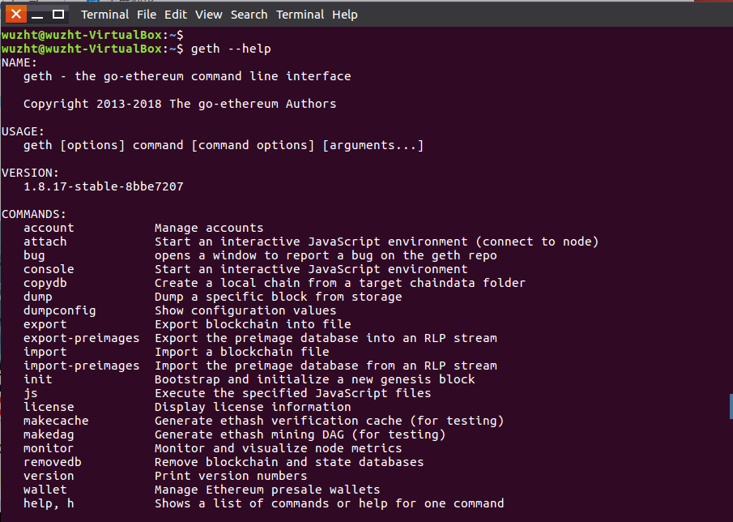
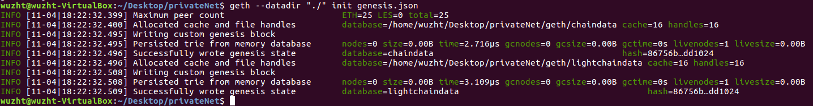
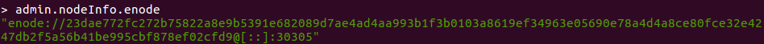
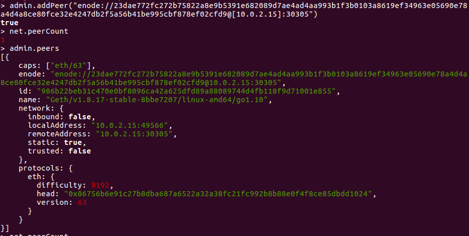
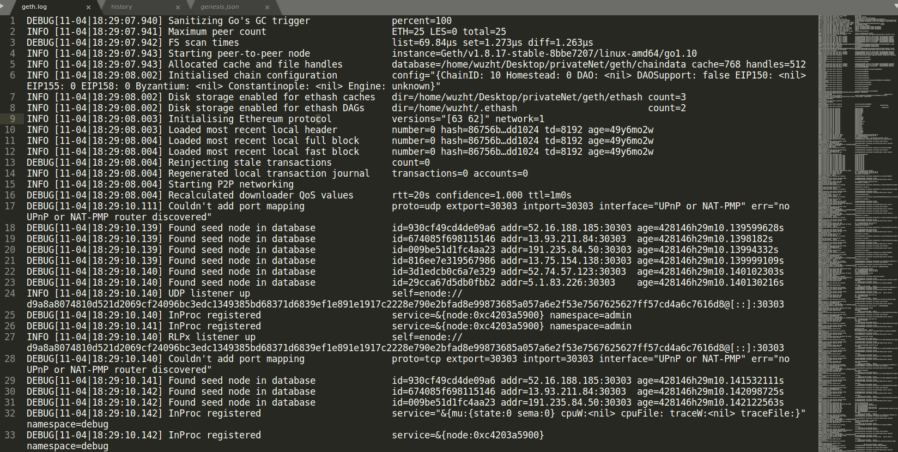
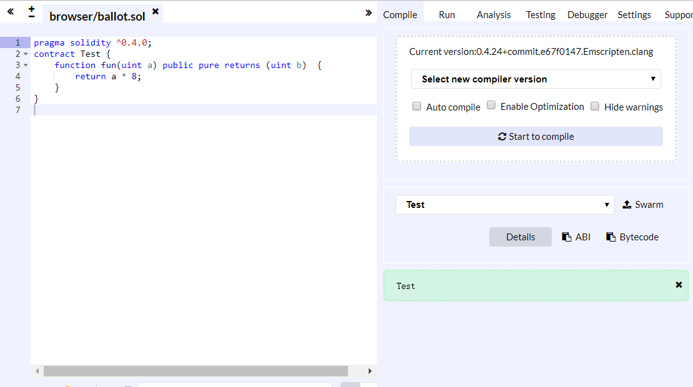
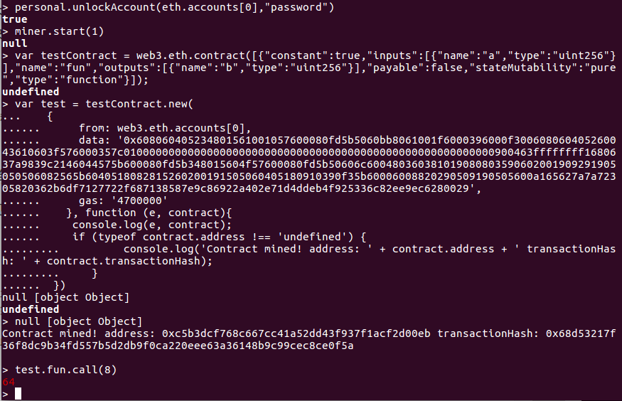
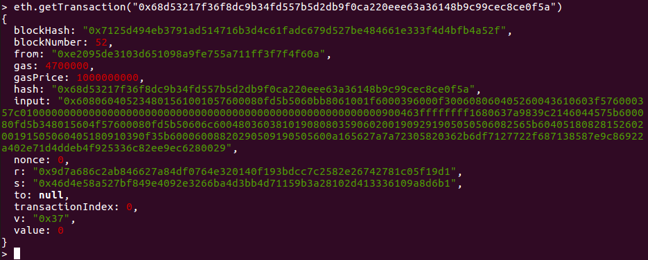

## 前期热身报告

> 参考博客：
>
> [以太坊区块链学习之搭建私链](https://blog.csdn.net/qq_35190319/article/details/79274870)
>
> [以太坊区块链学习之在私链上部署合约](https://blog.csdn.net/qq_35190319/article/details/79283890)
>
> [以太坊学习（4）geth搭建私有链--加入节点](https://blog.csdn.net/dieju8330/article/details/81673175)


[TOC]

### 以太坊的安装、私有链创世区块搭建、私有链节点的加入（选做）

以下操作在unbuntu虚拟机上进行

* **以太坊的安装**

  安装方式见以太坊官网：https://www.ethereum.org/cli

  其中Unbuntu中的安装方法是在终端里执行以下命令：

  ```
  sudo apt-get install software-properties-common
  sudo add-apt-repository -y ppa:ethereum/ethereum
  sudo apt-get update
  sudo apt-get install ethereum
  ```

  如下图即安装成功：

  

* **私有链创世区块搭建**

  创建一个文件夹`mkdir privateNet`，然后进入该文件夹`cd privateNet`。在该目录下创建一个genesis.json文件，内容如下：

  ```json
  {
    "config": {
          "chainId": 10,
          "homesteadBlock": 0,
          "eip155Block": 0,
          "eip158Block": 0
      },
    "coinbase"   : "0x0000000000000000000000000000000000000000",
    "difficulty" : "0x2000",
    "extraData"  : "",
    "gasLimit"   : "0x8000000",
    "nonce"      : "0x0000000000000042",
    "mixhash"    : "0x0000000000000000000000000000000000000000000000000000000000000000",
    "parentHash" : "0x0000000000000000000000000000000000000000000000000000000000000000",
    "timestamp"  : "0x00",
    "alloc": {}
  }
  ```

  创建创世区块：

  `geth --datadir "./" init genesis.json`

  执行成功：

  

* **私有链节点的加入**

  * 创建文件夹`newPeer`，把上述privateNet文件夹中的genesis.json、keystore文件夹复制到newPeer文件夹中

  * 打开一个终端，在geth进程A中启动节点：

    `geth --datadir "./" --networkid 989898 -rpc console --port 30304 --rpcport 8546`

    此时输入`net.peerCount`，返回的是0

  * 打开另外一个终端，

    * 创建节点：`geth --datadir "./" init genesis.json`

    * 在geth进程B中启动节点，注意端口号跟进程A不同：

      `geth --datadir "./" --networkid 989898 -rpc console --port 30305 --rpcport 8547`

    ​	其中，**--networkid 989898  需同进程A中的节点一致**

    * 查看节点信息：`admin.nodeInfo.enode`，如下所示

      

    * 将[::]中的:: 替换成虚拟机B的ip：

  * 在进程A中，动态添加节点并显示结果，节点添加成功：

    


### 对 getBlock 中所得区块的各个字段进行解释

调用`getBlock`返回信息如下：


字段解释：

`返回值` - 区块对象：

* `difficulty` - BigNumber类型。当前块的难度，整数。
* `extraData` - 字符串。当前块的extra data字段。
* `gasLimit` - Number，当前区块允许使用的最大gas。
* `gasUsed` - 当前区块累计使用的总的gas。
* `hash` - 字符串，区块的哈希串。当这个区块处于pending将会返回null。
* `logsBloom` - 字符串，区块日志的布隆过滤器。当这个区块处于pending将会返回null。
* `miner` - 字符串，20字节。这个区块获得奖励的矿工。
* `mixHash` - 字符串。与nonce配合用于挖矿，由上一个区块的一部分生成的hash。
* `nonce` - 字符串，8字节。POW生成的哈希。当这个区块处于pending将会返回null。
* `number` - 区块号。当这个区块处于pending将会返回null。
* `parentHash` - 字符串，32字节的父区块的哈希值。
* `receiptsRoot` - 字符串，32字节。区块的收据前缀树的根哈希值。
* `sha3Uncles` - 字符串，32字节。叔区块的哈希值。
* `size` - Number。当前这个块的字节大小。
* `stateRoot` - 字符串，32字节。区块的最终状态前缀树的根哈希值。
* `timestamp` - Number。区块打包时的unix时间戳。
* `totalDifficulty` - BigNumber类型。区块链到当前块的总难度，整数。
* `transactions` - 数组。交易对象。或者是32字节的交易哈希。
* `transactionsRoot` - 字符串，32字节。区块的交易前缀树的根哈希值。
* `uncles` - 数组。叔哈希的数组。


### 对日志输出进行解释

刚启动节点时的日志输出如下，显示了一些当前节点的运行信息与情况：



* ```
  INFO [11-04|19:41:35.226] Setting new local account                address=0xe2095De3103d651098a9fe755a711FF3F7F4F60A
  ```

  执行解锁账户时的日志输出，`address`显示的就是创建账户时返回的值

* ```
  INFO [11-04|19:41:35.226] Submitted contract creation              fullhash=0x68d53217f36f8dc9b34fd557b5d2db9f0ca220eee63a36148b9c99cec8ce0f5a contract=0xc5b3Dcf768C667cC41a52dd43f937F1aCf2d00eb
  ```

  提交编写的智能合约时的日志输出，`fullhash`就是对应transaction的哈希值，可以通过`getTransaction`查看

* ```
  INFO [11-04|19:42:28.914] Successfully sealed new block            number=59 sealhash=c828e9…9026fc hash=1ba8ba…21140b elapsed=14.119s
  DEBUG[11-04|19:42:28.915] Reinjecting stale transactions           count=0
  INFO [11-04|19:42:28.915] 🔗 block reached canonical chain          number=52 hash=7125d4…b4a52f
  INFO [11-04|19:42:28.915] 🔨 mined potential block                  number=59 hash=1ba8ba…21140b
  ```

  挖到新区块时的日志输出，number为当前区块号


### 编写简单的智能合约，在 remix下进行调试，并部署在链上进行调用

智能合约代码如下：

```javascript
pragma solidity ^0.4.0;
contract Test {
    function fun(uint a) public pure returns (uint b)  {
        return a * 8;
    }
}
```

功能：输入一个无符号数`a`，返回`a*8`

在remix下编译通过：



首先解锁账户：

`personal.unlockAccount(eth.accounts[0],"password")`

然后开始挖矿：

`miner.start(1)`

点击Details按钮，弹出消息框，复制WEB3DEPLOY中的代码到终端中，按下回车，稍等片刻，当终端返回信息`Contract mined!`，合约部署成功。如下图所示：



与合约交互：`test.fun.call(8)`，返回64


### 对交易的字段进行解释

部署的合约被挖到后显示的`Contract mined!`后面有一个`transactionHash`，是该交易的哈希值。

执行`eth.getTransaction("0x68d53217f36f8dc9b34fd557b5d2db9f0ca220eee63a36148b9c99cec8ce0f5a")`

得到以下结果：



字段解释：

* `blockHash`该交易(事务，transaction)所在区块的哈希值
* `blockNumber`该交易所在区块的区块号
* `from`交易发送者的地址
* `to`交易接收者的地址。创建以太坊智能合约时，to的地址是空的。如果为空则意味这是一个创建智能合约的交易。
* `value`发送者要转移给接收者的以太币数量
* `data(input)`存在的数据字段，如果存在，则是表明该交易是一个创建或者调用智能合约交易
* `Gas Limit(Gas)`表示这个交易允许消耗的最大Gas数量
* `GasPrice`表示发送者愿意支付给矿工的Gas价格
* `nonce`用来区别同一用户发出的不同交易的标记
* `hash`由以上信息生成的散列值（哈希值），作为交易的ID
* `r, s, v`交易签名的三个部分，由发送者的私钥对交易hash进行签名生成