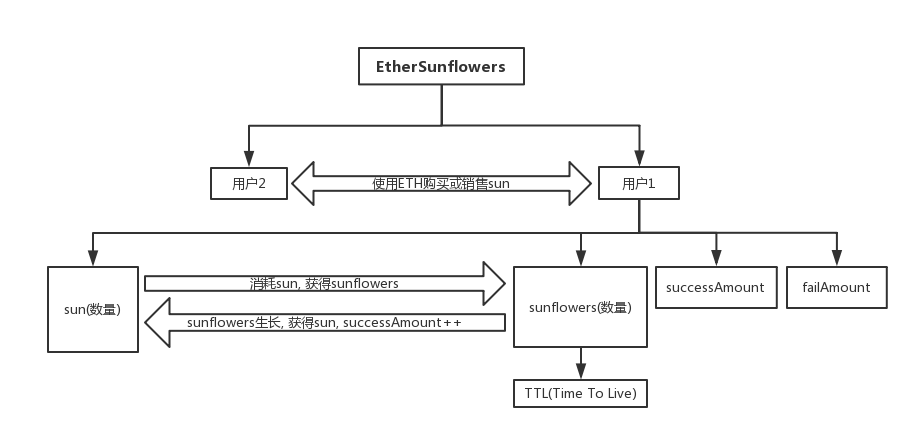

## 区块链Project题目

### 以太向日葵 EtherSunflowers

#### 选题背景

如今，许许多多的学生以及工作者，或多或少都会有些惰性，在面对学业或工作的压力时，由于没有很好的时间管理意识，很多人会成为一个"拖延症"患者。即接到工作任务后，不是立刻去努力完成，而是懒惰地消耗时间，不到DDL(Deadline)就不会去做。当时间越靠近DDL就会越焦虑，于是最终把工作任务草率地完成，质量很低。如此一来，”拖延症“不断地恶性循环，最终导致大量的时间荒废。

EtherSunflowers是一款有趣的计时器，是运行于以太坊的一个智能合约。EtherSunflowers就是为了拯救”拖延症“患者而诞生的，结合区块链的特性，协助用户培养自己的时间管理意识，克服惰性，提升工作效率。

#### 项目构思

EtherSunflowers结合了游戏的元素，通过游戏内的奖惩机制，来培养用户的时间意识。EtherSunflowers的计时，采用”25+5“模式，让用户认真工作25分钟，然后休息5分钟，实现最佳的工作效率。用户在工作时通过奖惩机制来帮助自己提升时间意识，同时在休息时可以通过游戏买卖来作为娱乐，放松身心。当用户开启了一个时钟周期（开始工作），若正常完成，就会得到奖励；若中途结束，则会受到惩罚。

其中，所有的数据都保存到区块链中，数据不可篡改，根据用户已完成的时钟周期与中途退出的时钟周期的多少，即可了解用户自己的时间管理意识。

* 时钟周期定义：

  25分钟工作时间 + 5分钟休息时间

* EtherSunflowers内有2种主要对象：
  * 阳光sun
  * 向日葵sunflower，每个sunflower有自己当前的TTL(Time To Live)

* 每个用户有自己的EtherSunflowers账户，有以下对象：

  * successAmount。已完成的时钟周期数，初始值为0
  * failAmount。中途退出的时钟周期数，初始值为0

  * sun。sun数量，初始数量为10，可以通过完成以下规则来赚取sun
  * sunflowersNum。sunflowers数量，初始值为0

* 规则如下：
  * 用户首次使用EtherSunflowers时，会被赠送10个sun，每消耗10个sun能获得1个sunflower。
  * 获得的每个sunflower，它有随机的生存时间TTL(暂定为5~20)
  * 在sunflower的生长过程中，正常完成一个时钟周期内会获得1个sun，TTL减一，successAmount加一。若开始了一个时钟周期却中途结束，不但不获得sun，而且sun数量会减5，TTL照样减一，同时，failAmount会加一。
  * 当该sunflower的TTL为0时，该sunflower就会死亡。

* sun可以购买和销售

  拥有越多的sun，就可以拥有越多的sunflower，从而在单个时钟周期内获得的sun就会越多。EtherSunflowers设置了sun的购买与销售的机制，各个用户之间可以通过以太币ETH购买与销售sun。

  请注意：当进行sun销售操作时，当前拥有的sunflower数量将会减半，因此应谨慎(在合适的时候)销售sun。此限制是为了防止用户大量销售少额的sun，从而使网络拥堵，提升智能合约的安全性。

* 主要逻辑图：

  

* 项目详细的参数(如sunflower的TTL等)设置待定。更详细丰富的功能在实现过程中待加入......
