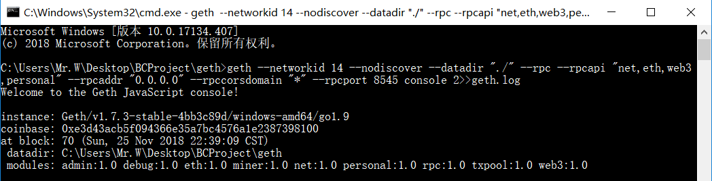
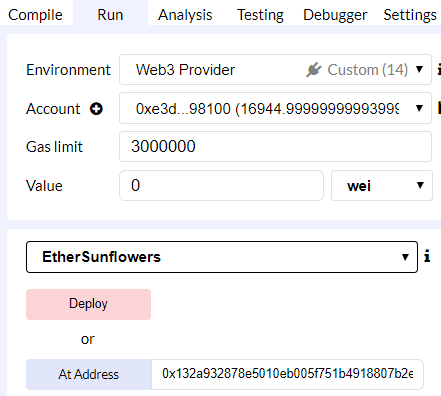
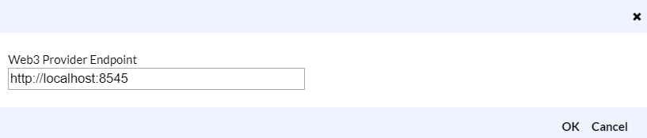
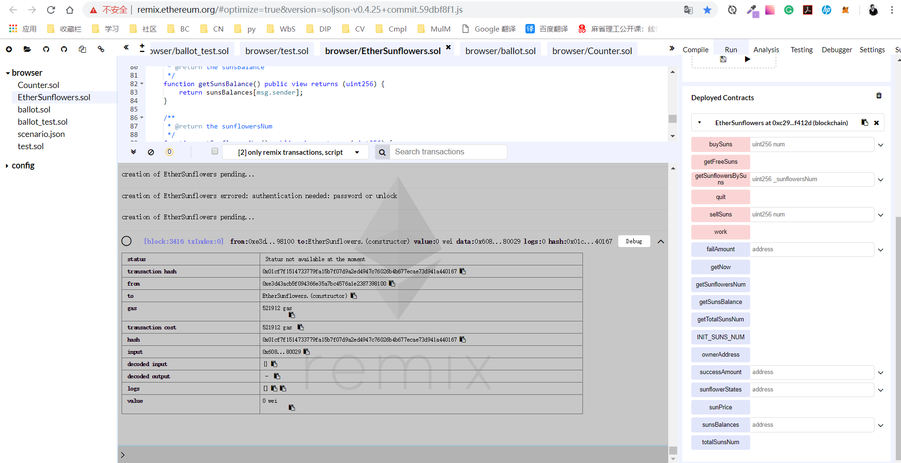
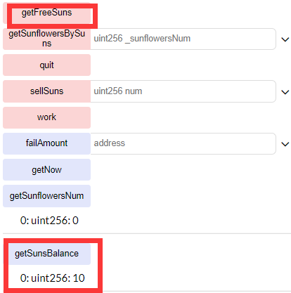
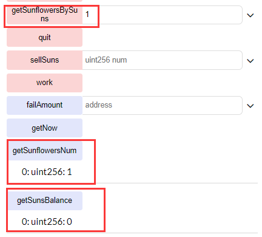
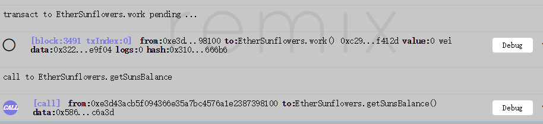
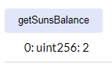

# 合约部署报告

## 智能合约接口设计

### 状态变量

```javascript
struct SunflowerState {
    uint256[] ttls;    // time to live
    uint256 sunflowersNum;
}

// Definition: A cycle is 30 minutes, including WORK_TIME and REST_TIME
uint256 private WORK_TIME = 1500;    // work time, 25 minutes, 1500 seconds
uint256 private REST_TIME = 300;     // rest time, 5 minutes, 300 seconds
uint256 public INIT_SUNS_NUM = 10;   // initial number of suns

mapping (address => uint256) public sunsBalances;   // the suns balances of an address
mapping (address => SunflowerState) public sunflowerStates;
mapping (address => uint256) public successAmount;  // amount of finishing a cycle
mapping (address => uint256) public failAmount;     // amount of fail finishing a cycle

// the total suns number in the contract
uint256 public totalSunsNum;
uint public constant sunPrice = 20;

address public ownerAddress;
```

* `SunflowerState` 结构体。sunflowers的状态，保存每个sunflower的ttl，以及当前用户拥有的sunflower数量
* `WORK_TIME` uint256。工作时间，25分钟
* `REST_TIME` uint256。休息时间，5分钟
* `INIT_SUNS_NUM` uint256。用户初始sun的数量
* `sunsBalances` mapping (address => uint256)。保存用户的sun数量
* `sunflowerStates` mapping (address => SunflowerState)。保存用户的sunflower状态
* `successAmount` mapping (address => uint256)。保存用户的成功完成的时钟周期数
* `failAmount` mapping (address => uint256)。保存用户的中途退出的时钟周期数
* `totalSunsNum` uint256。合约当前的sun数量
* `sunPrice` uint256。当前sun的单价
* `ownerAddress` address。owner的地址

### 接口设计

* `constructor() public`

  初始化相关状态变量

* `function getFreeSuns() public`

  用户初次使用时，可以调用一次该函数，免费获得10个sun

* `function getSunflowersBySuns(uint256 _sunflowersNum) public`

  * `uint256 _sunflowersNum` 要换取的sunflowers数量

  用suns换取sunflowers，每10个suns换取1个sunflowers

* `function work() public`

  进入工作状态，25分钟后，用户suns增加，并且对应的successAmount++

* `function quit() public`

  中途退出工作状态，用户收到惩罚，并且对应的failAmount++

* `function rest() private pure`

  5分钟休息状态，此时用户可以做其他事情，而不可以调用work()

* `function sellSuns(uint256 num) public payable`

  * `uint256 num` 要卖的sun数量

  用户通过以太币卖出sun

* `function buySuns(uint256 num) public payable`

  * `uint256 num` 要买的sun数量

  用户通过以太币买入sun

* `function getSunsBalance() public view returns (uint256)`

  返回用户的sun数量

* `function getSunflowersNum() public view returns (uint256)`

  返回用户的sunflower数量

* `function getTotalSunsNum() public view returns (uint256)`

  返回合约当前的sun数量

## 使用remix ethereum部署智能合约

> 参考博客：
>
> [以太坊区块链学习之在私链上部署合约](https://blog.csdn.net/qq_35190319/article/details/79283890)
>
> [使用remix ethereum部署智能合约](https://blog.csdn.net/yinanmo5569/article/details/80372133)

### 使用Remix连接私有链

#### 启动节点

首先需要启动节点，注意需要将 rpcaddr 设置为 0.0.0.0，rpccorsdomain设置为 “*”，保证remix可以连接私有链。另外`--datadir "./"`表示数据存在当前目录下，在`geth.log`中记录

`geth --networkid 10 --nodiscover --datadir "./" --rpc --rpcapi "net,eth,web3,personal" --rpcaddr "0.0.0.0" --rpccorsdomain "*" --rpcport 8545 console 2>>geth.log`



#### 打开remix操作

注意url是http而不是https(否则web3 provider会连不上)：http://remix.ethereum.org/#optimize=true&version=soljson-v0.4.25+commit.59dbf8f1.js

再在run中的Environment选择web3 provider，



然后web3 provider endpoint按照默认的就好



先开启挖矿，然后选择EtherSunflowers，然后Deploy，部署成功之后如下图：



报错：creation of EtherSunflowers errored: authentication needed: password or unlock

这种情况需要在geth中给账号解锁

```javascript
personal.unlockAccount(eth.accounts[0],"password");
```


## 调用函数

* 一开始调用`getSunflowersNum`, `getSunsBalance`，都返回0


* 调用`getFreeSuns`，获取10个sun，然后 `getSunsBalance`，返回10



* 调用`getSunflowersBySuns(1)`，用10个sun换取一个sunflower，然后`getSunflowersNum`，返回1，调用`getSunsBalance`，返回0



* 调用`work`，再调用`getSunsBalance`，可以看到sun的数量增加了





* 其他更详细的功能有待增加...